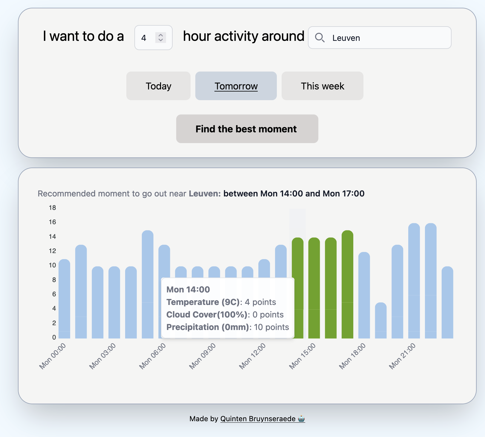

  

  time2go helps you find the right moment to go outside

You can use this simple web app to find the best moment to do an outdoor activity. After entering a duration, time range and location, you receive a suggested time to do your activity.

  

## How is a suggestion made?

Each hour is scored on three criteria: temperature, cloud cover and precipitation. A simple scoring function is applied to turn the value into a score. The sum of all scores is the total score of a certain moment.

Your final suggestion is the first moment that has the highest combined score over the requested duration.
